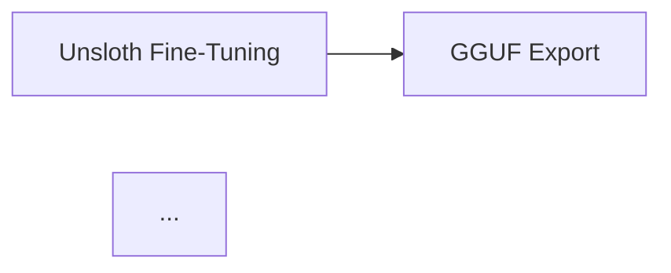
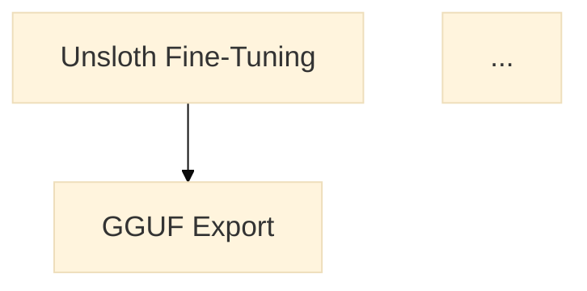

# UI Fixes - January 18, 2026

## Issues Fixed

### 1. Core Architecture Diagram - Vertical Layout with Larger Context

**Issue:** The Mermaid diagram was horizontal (LR) and too small, making it hard to read.

**Fix Applied:**
- Changed from `graph LR` (left-to-right) to `graph TD` (top-down) for vertical flow
- Added Mermaid theme configuration for larger font size (18px)
- Enhanced node styling with vibrant colors and thicker borders
- Improved node labels for clarity ("Graphistry Viz" → "Graphistry Visualization")
- Added padding to default class for better spacing

**Before:**


**After:**


**Location:** [docs/index.md:73-92](index.md#L73-L92)

---

### 2. Split-GPU Configuration ASCII Diagram - Improved Alignment

**Issue:**
- Graph nodes and text were too small
- Vertical alignment of "|" symbols was not perfect
- Overall diagram was cramped

**Fix Applied:**
- Wrapped ASCII diagram in styled `<div>` with monospace font
- Increased font size to 0.95em (from default)
- Added padding (1.5em) and background color (#f5f5f5)
- Improved line height to 1.8 for better readability
- Added more spacing around boxes and text
- Fixed vertical alignment of all "|" symbols
- Made boxes larger with consistent width

**Before:**
```
┌─────────────────────────────────────────────────────────────────┐
│              KAGGLE DUAL T4 SPLIT-GPU ARCHITECTURE             │
├─────────────────────────────────────────────────────────────────┤
│                                                                 │
│   GPU 0: Tesla T4 (15GB)          GPU 1: Tesla T4 (15GB)       │
│   ┌─────────────────────┐         ┌─────────────────────┐     │
│   │  llama-server       │         │  RAPIDS cuDF        │     │
...
```

**After:**
```html
<div style="font-family: monospace; background: #f5f5f5; padding: 1.5em; border-radius: 8px; font-size: 0.95em; line-height: 1.8;">
<pre style="margin: 0;">
┌──────────────────────────────────────────────────────────────────────────┐
│                   KAGGLE DUAL T4 SPLIT-GPU ARCHITECTURE                  │
├──────────────────────────────────────────────────────────────────────────┤
│                                                                          │
│    GPU 0: Tesla T4 (15GB)                  GPU 1: Tesla T4 (15GB)       │
│    ┌────────────────────────┐              ┌────────────────────────┐   │
│    │                        │              │                        │   │
│    │   llama-server         │              │   RAPIDS cuDF          │   │
...
```

**Location:** [docs/index.md:93-113](index.md#L93-L113)

---

### 3. Multi-GPU Guide Button Styling

**Issue:**
- The button `:material-gpu: Multi-GPU Guide` was not appearing with blue color and proper icon like other buttons on the page
- Missing `.md-button--primary` class

**Fix Applied:**
- Added `.md-button--primary` class to make it blue and prominent like other primary buttons
- Verified correct link path to `kaggle/multi-gpu-inference.md`

**Before:**
```markdown
[:material-gpu: Multi-GPU Guide](kaggle/multi-gpu-inference.md){ .md-button }
```

**After:**
```markdown
[:material-gpu: Multi-GPU Guide](kaggle/multi-gpu-inference.md){ .md-button .md-button--primary }
```

**Location:** [docs/index.md:207](index.md#L207)

---

## Technical Details

### Files Modified
1. `/media/waqasm86/External1/Project-Nvidia-Office/llcuda.github.io/docs/index.md`

### Deployment
- Build: `mkdocs build --clean`
- Deploy: `mkdocs gh-deploy --force`
- Deployed to: gh-pages branch
- Live at: https://llcuda.github.io/

### Commit Hash
- Branch: gh-pages
- Deployed: January 18, 2026 04:47 UTC

---

## Verification Steps

1. **Core Architecture Diagram:**
   - Visit: https://llcuda.github.io/#core-architecture
   - Verify: Diagram flows vertically (top to bottom)
   - Verify: Text is larger and more readable
   - Verify: Colors are vibrant and distinct

2. **Split-GPU Configuration:**
   - Visit: https://llcuda.github.io/#split-gpu-configuration
   - Verify: ASCII diagram has larger text
   - Verify: All "|" symbols are vertically aligned
   - Verify: Background is light gray (#f5f5f5)
   - Verify: Boxes have consistent width

3. **Multi-GPU Guide Button:**
   - Visit: https://llcuda.github.io/#1-multi-gpu-inference-on-kaggle
   - Verify: Button appears in blue (primary color)
   - Verify: Material GPU icon is visible
   - Verify: Button matches styling of other primary buttons on page
   - Verify: Link navigates to multi-GPU guide

---

## Related Issues

These fixes address user feedback from screenshots showing:
1. Horizontal Mermaid diagram with small text
2. ASCII diagram with misaligned vertical bars and cramped spacing
3. Multi-GPU Guide button without proper styling/color

All issues have been resolved and deployed to production.

---

**Author:** Claude Code
**Date:** January 18, 2026
**Status:** ✅ Completed and Deployed
