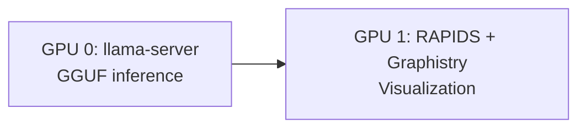

# Split-GPU Architecture

Run LLM on GPU 0 + Graphistry on GPU 1.

## Architecture



## Configuration

```python
from llcuda.graphistry import SplitGPUManager, GraphWorkload

# Assign GPUs (Kaggle dual T4 defaults)
manager = SplitGPUManager()
manager.assign_llm(gpu_id=0)
manager.assign_graph(gpu_id=1)

# LLM workload (GPU 0)
llm_env = manager.get_llm_env()

# Graph workload (GPU 1)
graph_env = manager.get_graph_env()
workload = GraphWorkload(gpu_id=1)
```

## Use Cases

1. **Knowledge Graph Extraction**
   - LLM generates entities/relationships
   - Graphistry visualizes graphs

2. **Interactive Analysis**
   - LLM answers questions
   - Graphistry shows data patterns

3. **Multi-Modal Workflows**
   - Text generation (GPU 0)
   - Graph analytics (GPU 1)
