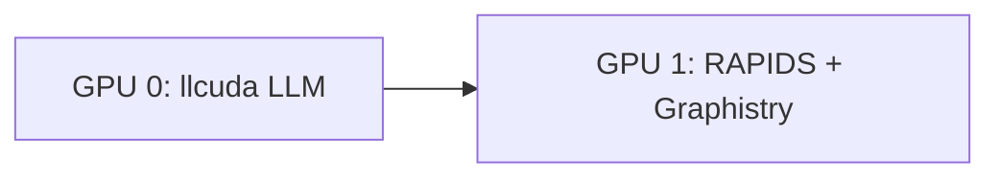

# Graphistry Integration

GPU-accelerated graph visualization with llcuda.

## What is Graphistry?

PyGraphistry provides:
- **GPU-accelerated** graph rendering
- **Millions** of nodes/edges
- **Interactive** exploration
- **RAPIDS** integration (cuDF, cuGraph)

## Split-GPU Architecture



## Quick Start

```python
from llcuda.graphistry import GraphWorkload, register_graphistry

# Use GPU 1 for graph workloads
workload = GraphWorkload(gpu_id=1)

# Register Graphistry (personal keys recommended)
register_graphistry(
    api=3,
    protocol="https",
    server="hub.graphistry.com"
)

# Visualize
g = workload.create_knowledge_graph(
    entities=[{"id": 1}, {"id": 2}, {"id": 3}],
    relationships=[{"source": 1, "target": 2}, {"source": 2, "target": 3}]
)
g.plot()
```

See:
- [Knowledge Graphs](knowledge-graphs.md)
- [RAPIDS Integration](rapids.md)
- [Examples](examples.md)
