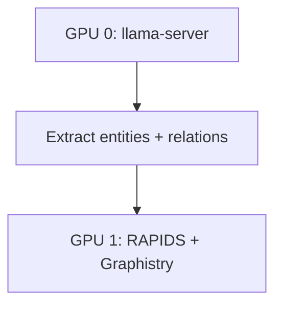

# Split-GPU Setup

Configure LLM on GPU 0 and Graphistry on GPU 1.

## Architecture



## Setup GPU 0 (LLM)

```python
from llcuda.server import ServerManager, ServerConfig
from llcuda.graphistry import SplitGPUManager

manager = SplitGPUManager()
manager.assign_llm(0)

config = ServerConfig(model_path="model.gguf", n_gpu_layers=99)
server = ServerManager()
server.start_with_config(config)
```

## Setup GPU 1 (Graphistry)

```python
from llcuda.graphistry import GraphWorkload, register_graphistry

workload = GraphWorkload(gpu_id=1)
register_graphistry(api=3, protocol="https", server="hub.graphistry.com")
```

## Workflow

1. Run LLM inference on GPU 0
2. Extract entities/relations from output
3. Build graph on GPU 1 with cuDF
4. Visualize with Graphistry

## See Also

- [Split-GPU Tutorial](../tutorials/06-split-gpu-graphistry.md)
- [Knowledge Graphs](../graphistry/knowledge-graphs.md)
