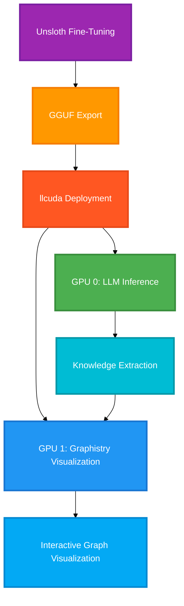

# llcuda v2.2.0: CUDA12 Inference Backend for Unsloth

<div style="text-align: center; margin: 2em 0;">
  
  
  
  
  
</div>

**CUDA12-first inference backend for Unsloth with Graphistry network visualization on Kaggle dual Tesla T4 GPUs.**
Fine-tune with Unsloth → Export to GGUF → Deploy on Kaggle → Visualize with Graphistry.

---

## :rocket: What is llcuda v2.2.0?

llcuda is a **CUDA 12 inference backend** specifically designed for deploying [Unsloth](https://unsloth.ai/)-fine-tuned models on **Kaggle's dual Tesla T4 GPUs** (30GB total VRAM). It provides:

### :material-gpu: Dual T4 Architecture

Run on Kaggle's **2× Tesla T4 GPUs** (15GB each)

- Native CUDA tensor-split for multi-GPU
- Support for 70B models with IQ3_XS quantization
- FlashAttention for 2-3x faster inference
- 961MB pre-built CUDA 12.5 binaries

### :material-account-network: Split-GPU Design

Unique architecture: **LLM on GPU 0 + Graphistry on GPU 1**

- GPU 0: llama.cpp server for LLM inference
- GPU 1: RAPIDS cuGraph + Graphistry visualization
- Extract knowledge graphs from LLM outputs
- Visualize millions of nodes and edges

### :material-lightning-bolt: Unsloth Integration

Seamless workflow from training to deployment

- Fine-tune with Unsloth (2x faster training)
- Export to GGUF format with `save_pretrained_gguf()`
- Deploy with llcuda on Kaggle
- Complete end-to-end pipeline

### :material-chart-line: Production Ready

Built for Kaggle production workloads

- OpenAI-compatible API via llama-server
- 29 quantization formats (K-quants, I-quants)
- NCCL support for PyTorch distributed
- Auto-download binaries from GitHub Releases

---

## :fire: Core Architecture

llcuda v2.2.0 implements a unique **split-GPU architecture** for Kaggle's dual T4 environment:

<div style="text-align: center;">



</div>

### Split-GPU Configuration

<div style="font-family: monospace; background: #f5f5f5; padding: 1.5em; border-radius: 8px; font-size: 0.95em; line-height: 1.8;">
<pre style="margin: 0;">
┌────────────────────────────────────────────────────────────────────────────┐
│                    KAGGLE DUAL T4 SPLIT-GPU ARCHITECTURE                   │
├────────────────────────────────────────────────────────────────────────────┤
│                                                                            │
│     GPU 0: Tesla T4 (15GB)                  GPU 1: Tesla T4 (15GB)         │
│     ┌────────────────────────┐              ┌────────────────────────┐     │
│     │                        │              │                        │     │
│     │   llama-server         │              │   RAPIDS cuDF          │     │
│     │   GGUF Model           │  ─────────>  │   cuGraph              │     │
│     │   LLM Inference        │   extract    │   Graphistry[ai]       │     │
│     │   ~5-12GB VRAM         │   graphs     │   Network Viz          │     │
│     │                        │              │                        │     │
│     └────────────────────────┘              └────────────────────────┘     │
│                                                                            │
│     • tensor-split for multi-GPU          • Millions of nodes/edges        │
│     • FlashAttention enabled              • GPU-accelerated rendering      │
│     • OpenAI API compatible               • Interactive exploration        │
│                                                                            │
└────────────────────────────────────────────────────────────────────────────┘
</pre>
</div>

---

## :zap: Quick Start (5 Minutes)

Get llcuda v2.2.0 running on Kaggle in just 5 minutes!

### Step 1: Install llcuda

```bash
# On Kaggle notebook
pip install git+https://github.com/llcuda/llcuda.git@v2.2.0
```

### Step 2: Verify Dual T4 Setup

```python
import llcuda
from llcuda.api.multigpu import detect_gpus, print_gpu_info

# Check GPU configuration
gpus = detect_gpus()
print(f"✓ Detected {len(gpus)} GPUs")
print_gpu_info()

# Expected output:
# ✓ Detected 2 GPUs
# GPU 0: Tesla T4 (15.0 GB)
# GPU 1: Tesla T4 (15.0 GB)
```

### Step 3: Run Basic Inference

```python
from llcuda.server import ServerManager, ServerConfig

# Configure for single GPU (GPU 0)
config = ServerConfig(
    model_path="model.gguf",  # Your GGUF model
    n_gpu_layers=99,          # Offload all layers to GPU
    flash_attn=True,          # Enable FlashAttention
)

# Start server
server = ServerManager()
server.start_with_config(config)
server.wait_until_ready()

# Use OpenAI API
from llcuda.api import LlamaCppClient

client = LlamaCppClient("http://localhost:8080")
response = client.chat.completions.create(
    messages=[{"role": "user", "content": "Explain quantum computing"}],
    max_tokens=200
)

print(response.choices[0].message.content)
```

!!! success "Auto-Download Binaries"
    CUDA binaries (961 MB) download automatically from [GitHub Releases v2.2.0](https://github.com/llcuda/llcuda/releases/tag/v2.2.0) on first import. Cached for future runs!

[:octicons-rocket-24: Full Installation Guide](guides/installation.md){ .md-button .md-button--primary }
[:material-notebook: Kaggle Setup Tutorial](guides/kaggle-setup.md){ .md-button }

---

## :star: Key Features of v2.2.0

### 1. Multi-GPU Inference on Kaggle

Run models up to **70B parameters** using both T4 GPUs with native CUDA tensor-split:

```python
from llcuda.api.multigpu import kaggle_t4_dual_config

# Optimized dual T4 configuration
config = kaggle_t4_dual_config(model_size_gb=25)  # For 70B IQ3_XS

print(config.to_cli_args())
# Output: ['-ngl', '-1', '--split-mode', 'layer', '--tensor-split', '0.5,0.5', '-fa']
```

**Supported Model Sizes on Dual T4 (30GB VRAM):**

| Model Size | Quantization | VRAM Required | Fits Dual T4? |
|------------|--------------|---------------|---------------|
| 1-3B | Q4_K_M | 2-3 GB | ✅ Single T4 |
| 7-8B | Q4_K_M | 5-6 GB | ✅ Single T4 |
| 13B | Q4_K_M | 8-9 GB | ✅ Single T4 |
| 32-34B | Q4_K_M | 20-22 GB | ✅ Dual T4 |
| **70B** | **IQ3_XS** | **25-27 GB** | ✅ **Dual T4** |

[:material-gpu: Multi-GPU Guide](kaggle/multi-gpu-inference.md){ .md-button .md-button--primary }

---

### 2. Unsloth Fine-Tuning Pipeline

Complete workflow from fine-tuning to deployment:

=== "Step 1: Fine-Tune with Unsloth"
    ```python
    from unsloth import FastLanguageModel

    # Load model for training
    model, tokenizer = FastLanguageModel.from_pretrained(
        model_name="unsloth/Qwen2.5-1.5B-Instruct",
        max_seq_length=2048,
        load_in_4bit=True,
    )

    # Add LoRA adapters
    model = FastLanguageModel.get_peft_model(
        model,
        r=16,
        target_modules=["q_proj", "k_proj", "v_proj"],
        lora_alpha=16,
        lora_dropout=0,
    )

    # Train your model...
    trainer.train()
    ```

=== "Step 2: Export to GGUF"
    ```python
    # Export fine-tuned model to GGUF format
    model.save_pretrained_gguf(
        "my_finetuned_model",
        tokenizer,
        quantization_method="q4_k_m"  # Recommended for T4
    )

    # Output: my_finetuned_model-Q4_K_M.gguf
    ```

=== "Step 3: Deploy with llcuda"
    ```python
    from llcuda.server import ServerManager, ServerConfig

    # Deploy on Kaggle dual T4
    config = ServerConfig(
        model_path="my_finetuned_model-Q4_K_M.gguf",
        n_gpu_layers=99,
        tensor_split="0.5,0.5",  # Use both GPUs
        flash_attn=True,
    )

    server = ServerManager()
    server.start_with_config(config)

    # Now serving at http://localhost:8080 with OpenAI API
    ```

[:material-rocket-launch: Unsloth Integration Guide](unsloth/overview.md){ .md-button .md-button--primary }

---

### 3. Split-GPU Architecture with Graphistry

Unique capability: **Run LLM inference on GPU 0 while using GPU 1 for RAPIDS/Graphistry visualization**

```python
from llcuda.graphistry import SplitGPUConfig
import graphistry

# Configure split-GPU setup
config = SplitGPUConfig(
    llm_gpu=0,      # GPU 0 for llama-server
    graph_gpu=1     # GPU 1 for Graphistry
)

# Set Graphistry to use GPU 1
graphistry.register(
    api=3,
    protocol="https",
    server="hub.graphistry.com"
)

# Now run LLM on GPU 0 and visualize graphs on GPU 1
```

**Use Cases:**
- Extract knowledge graphs from LLM outputs → Visualize with Graphistry
- Analyze entity relationships in generated text
- Interactive exploration of LLM-generated networks
- Real-time graph updates from streaming LLM responses

[:material-graph: Graphistry Integration Guide](graphistry/overview.md){ .md-button }

---

### 4. 29 GGUF Quantization Formats

llcuda supports all llama.cpp quantization types:

=== "K-Quants (Recommended)"
    Best quality-to-size ratio with double quantization:

    - **Q4_K_M** - 4.8 bpw, best for most models (recommended)
    - **Q5_K_M** - 5.7 bpw, higher quality
    - **Q6_K** - 6.6 bpw, near FP16 quality
    - **Q8_0** - 8.5 bpw, very high quality

=== "I-Quants (Best Compression)"
    Importance-matrix quantization for 70B models:

    - **IQ3_XS** - 3.3 bpw, fits 70B on dual T4
    - **IQ4_XS** - 4.3 bpw, better quality
    - **IQ2_XS** - 2.3 bpw, extreme compression
    - **IQ1_S** - 1.6 bpw, smallest possible

=== "Legacy Quants"
    Standard quantization types:

    - **Q4_0** - 4.5 bpw, legacy format
    - **Q5_0** - 5.5 bpw, legacy format
    - **Q8_0** - 8.5 bpw, high precision

=== "Full Precision"
    Unquantized formats:

    - **F32** - 32-bit float
    - **F16** - 16-bit float
    - **BF16** - Brain float 16

[:material-database: GGUF Quantization Guide](gguf/overview.md){ .md-button }

---

## :chart_with_upwards_trend: Performance Benchmarks

Real Kaggle dual T4 performance metrics:

| Model | Quantization | GPUs | Tokens/sec | Latency | VRAM Usage |
|-------|--------------|------|------------|---------|------------|
| Gemma 2-2B | Q4_K_M | 2× T4 | ~60 tok/s | - | 4 GB |
| Qwen2.5-7B | Q4_K_M | 2× T4 | ~35 tok/s | - | 10 GB |
| Llama-3.1-70B | IQ3_XS | 2× T4 | ~8-12 tok/s | - | 27 GB |
| Gemma 3-1B | Q4_K_M | 1× T4 | ~45 tok/s | 690ms | 3 GB |

!!! tip "Performance Optimization"
    - Enable FlashAttention for 2-3x speedup
    - Use tensor-split for models >15GB
    - K-quants provide best quality/speed balance
    - I-quants enable 70B models on 30GB VRAM

[:material-speedometer: Full Benchmarks](performance/benchmarks.md){ .md-button }

---

## :notebook: Tutorial Notebooks (10 Kaggle Notebooks)

Complete tutorial series for Kaggle dual T4 environment:

| # | Notebook | Open in Kaggle | Description | Time |
|---|----------|----------------|-------------|------|
| 01 | [Quick Start](tutorials/01-quickstart.md) | [](https://kaggle.com/kernels/welcome?src=https://github.com/llcuda/llcuda/blob/main/notebooks/01-quickstart-llcuda-v2.2.0.ipynb) | 5-minute introduction | 5 min |
| 02 | [Server Setup](tutorials/02-server-setup.md) | [](https://kaggle.com/kernels/welcome?src=https://github.com/llcuda/llcuda/blob/main/notebooks/02-llama-server-setup-llcuda-v2.2.0.ipynb) | Server configuration & lifecycle | 15 min |
| 03 | [Multi-GPU](tutorials/03-multi-gpu.md) | [](https://kaggle.com/kernels/welcome?src=https://github.com/llcuda/llcuda/blob/main/notebooks/03-multi-gpu-inference-llcuda-v2.2.0.ipynb) | Dual T4 tensor-split | 20 min |
| 04 | [GGUF Quantization](tutorials/04-gguf-quantization.md) | [](https://kaggle.com/kernels/welcome?src=https://github.com/llcuda/llcuda/blob/main/notebooks/04-gguf-quantization-llcuda-v2.2.0.ipynb) | K-quants, I-quants, parsing | 20 min |
| 05 | [Unsloth Integration](tutorials/05-unsloth-integration.md) | [](https://kaggle.com/kernels/welcome?src=https://github.com/llcuda/llcuda/blob/main/notebooks/05-unsloth-integration-llcuda-v2.2.0.ipynb) | Fine-tune → GGUF → Deploy | 30 min |
| 06 | [Split-GPU + Graphistry](tutorials/06-split-gpu-graphistry.md) | [](https://kaggle.com/kernels/welcome?src=https://github.com/llcuda/llcuda/blob/main/notebooks/06-split-gpu-graphistry-llcuda-v2.2.0.ipynb) | LLM + RAPIDS visualization | 30 min |
| 07 | [OpenAI API](tutorials/07-openai-api.md) | [](https://kaggle.com/kernels/welcome?src=https://github.com/llcuda/llcuda/blob/main/notebooks/07-openai-api-client-llcuda-v2.2.0.ipynb) | Drop-in OpenAI SDK | 15 min |
| 08 | [NCCL + PyTorch](tutorials/08-nccl-pytorch.md) | [](https://kaggle.com/kernels/welcome?src=https://github.com/llcuda/llcuda/blob/main/notebooks/08-nccl-pytorch-llcuda-v2.2.0.ipynb) | Distributed PyTorch | 25 min |
| 09 | [Large Models (70B)](tutorials/09-large-models.md) | [](https://kaggle.com/kernels/welcome?src=https://github.com/llcuda/llcuda/blob/main/notebooks/09-large-models-kaggle-llcuda-v2.2.0.ipynb) | 70B on dual T4 with IQ3_XS | 30 min |
| 10 | [Complete Workflow](tutorials/10-complete-workflow.md) | [](https://kaggle.com/kernels/welcome?src=https://github.com/llcuda/llcuda/blob/main/notebooks/10-complete-workflow-llcuda-v2.2.0.ipynb) | End-to-end production | 45 min |

[:material-notebook: View All Tutorials](tutorials/index.md){ .md-button .md-button--primary }

---

## :books: Learning Paths

Choose your path based on experience level:

=== "Beginner (1 hour)"
    ```
    01 Quick Start → 02 Server Setup → 03 Multi-GPU
    ```

    Perfect for first-time users. Learn the basics of llcuda on Kaggle.

=== "Intermediate (3 hours)"
    ```
    01 → 02 → 03 → 04 → 05 → 06 → 07 → 10
    ```

    Complete fundamentals through advanced workflows.

=== "Advanced (2 hours)"
    ```
    01 → 03 → 08 → 09
    ```

    Focus on multi-GPU and large model deployment.

=== "Unsloth Focus (2 hours)"
    ```
    01 → 04 → 05 → 10
    ```

    Fine-tuning and deployment pipeline.

---

## :sparkles: What's New in v2.2.0

!!! success "Major Release Highlights"

    **Positioned as Unsloth Inference Backend**

    - llcuda is now the official CUDA12 inference backend for Unsloth
    - Seamless workflow: Unsloth (training) → llcuda (inference)
    - Complete Kaggle dual T4 build notebook included

**New Features:**

- **Kaggle Dual T4 Build** - Complete build notebook for reproducible binaries
- **Split-GPU Architecture** - LLM on GPU 0 + Graphistry on GPU 1
- **Multi-GPU Clarification** - Native CUDA tensor-split (NOT NCCL)
- **961MB Binary Package** - Pre-built CUDA 12.5 binaries for T4
- **Graphistry Integration** - PyGraphistry for knowledge graph visualization
- **70B Model Support** - IQ3_XS quantization for large models
- **FlashAttention All Quants** - Enabled for all quantization types

**Performance:**

| Platform | GPU | Model | Tokens/sec |
|----------|-----|-------|------------|
| Kaggle | 2× T4 | Gemma 2-2B Q4_K_M | ~60 tok/s |
| Kaggle | 2× T4 | Llama 70B IQ3_XS | ~12 tok/s |

[:octicons-file-code-24: Full Changelog](https://github.com/llcuda/llcuda/blob/main/CHANGELOG.md){ .md-button }

---

## :gear: Technical Architecture

llcuda v2.2.0 is built on proven technologies:

<div class="grid cards" markdown>

-   **llama.cpp Server**

    ---

    - Build 7760 (commit 388ce82)
    - OpenAI-compatible API
    - Native CUDA tensor-split
    - FlashAttention support

-   **CUDA 12.5**

    ---

    - SM 7.5 (Turing) targeting
    - cuBLAS acceleration
    - Static linking
    - 961MB binary package

-   **Python 3.11+**

    ---

    - Type-safe APIs
    - Async/await support
    - Modern packaging
    - 62KB pip package

-   **RAPIDS + Graphistry**

    ---

    - cuDF for GPU DataFrames
    - cuGraph for network analysis
    - PyGraphistry visualization
    - Millions of nodes/edges

</div>

---

## :material-api: API Reference

llcuda provides comprehensive Python APIs:

| Module | Description |
|--------|-------------|
| [`llcuda.api.client`](api/client.md) | OpenAI-compatible llama.cpp client |
| [`llcuda.api.multigpu`](api/multigpu.md) | Multi-GPU configuration for Kaggle |
| [`llcuda.api.gguf`](api/gguf.md) | GGUF parsing and quantization tools |
| [`llcuda.api.nccl`](api/nccl.md) | NCCL for distributed PyTorch |
| [`llcuda.server`](api/server.md) | Server lifecycle management |
| [`llcuda.graphistry`](api/graphistry.md) | Graphistry integration helpers |

[:material-code-braces: Full API Documentation](api/overview.md){ .md-button }

---

## :handshake: Community & Support

- **GitHub Repository**: [github.com/llcuda/llcuda](https://github.com/llcuda/llcuda)
- **GitHub Releases**: [v2.2.0 Download](https://github.com/llcuda/llcuda/releases/tag/v2.2.0)
- **Bug Reports**: [GitHub Issues](https://github.com/llcuda/llcuda/issues)
- **Email**: [waqasm86@gmail.com](mailto:waqasm86@gmail.com)

---

## :balance_scale: License

MIT License - Free for commercial and personal use. See [LICENSE](https://github.com/llcuda/llcuda/blob/main/LICENSE).

---

<div style="text-align: center; color: #666; font-size: 0.9em; margin-top: 3em;">
  Built with ❤️ by <a href="https://github.com/waqasm86">Waqas Muhammad</a> | Powered by <a href="https://github.com/ggml-org/llama.cpp">llama.cpp</a> | Optimized for <a href="https://unsloth.ai">Unsloth</a> & <a href="https://www.graphistry.com">Graphistry</a>
</div>
